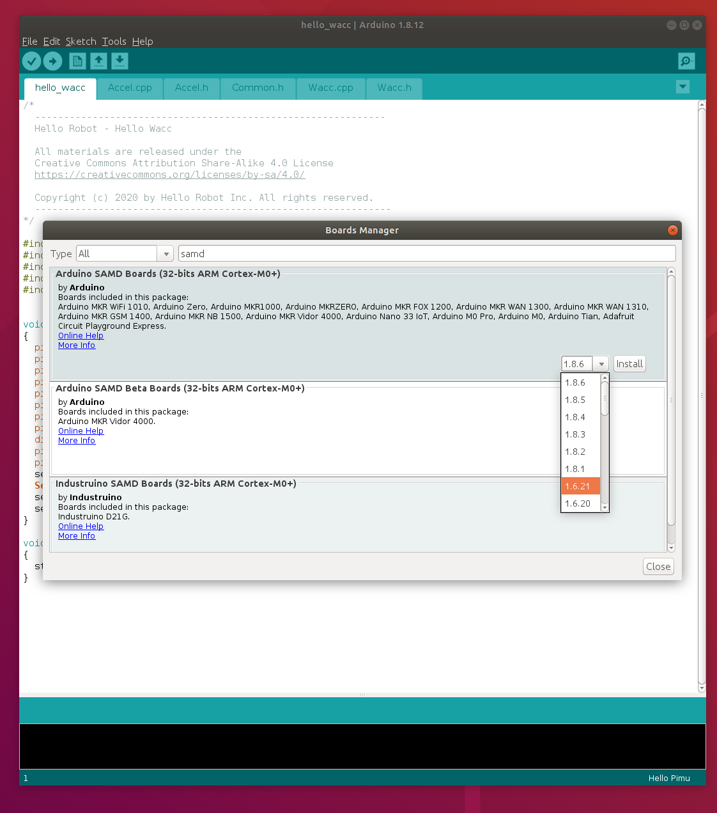

# Overview

The stretch_firmware repository provides the Arduino based firmware for the Stretch robot. The user is not expected to modify the firmware. However, it may occasionally be necessary to update the Stretch firmware while doing a Hello Robot recommended software upgrade. 

The repository includes: 

* hello_stepper: stepper motor controller based on the Mechaduino project
* hello_pimu:  power and imu board (Pimu) in the base
* hello_wacc: wrist accelerometer board (Wacc) in the wrist 
* Hello_Serial_Transport: serial communication library

Additional 3rd party libraries are provided for convenience.

## Release Notes
Version 0.0.1 (2020/05/8)
* Initial public release for Guthrie robot
* Compatable with firmware 0.0.1.p0

## License

For details, see the LICENSE.md file in the root directory. All materials within this repository are licensed with the [GNU General Public License v3.0 (GNU GPLv3)](https://www.gnu.org/licenses/gpl-3.0.html) except where other third-party licenses must apply.  

We thank people who have contributed to this work via open-source code and open hardware. We especially thank the [Mechaduino](https://tropical-labs.com/mechaduino/) project and [Tropical Labs](https://tropical-labs.com/). The motor controller firmware and hardware are derived from the excellent [firmware](https://github.com/jcchurch13/Mechaduino-Firmware) and [hardware](https://github.com/jcchurch13/Mechaduino-Hardware) created for the Mechaduino project by Tropical Labs.

# Installation

## Clone the repository

```
cd ~/repos
git clone https://github.com/hello-robot/stretch_firmware
```

## Install the Arduino IDE

In order to update the firmware you'll need to install the recommended IDE and libraries.

* Download and unzip the latest version (1.8.12 as of this writing) from the [Arduino site](https://www.arduino.cc/en/main/software)
  * The Ubuntu package does not play well with stretch_firmware. Do not use this one.

```bash
cd Downloads
tar -xvf arduino-1.8.12-linux64.tar.xz
cd arduino-1.8.12
sudo ./install.sh
arduino
```

Set the default Sketchbook location under File/Preferences to 

```
~/repos/stretch_firmware/arduino
```


Now close down and restart the IDE. Now under Tools/Board you should see the three Hello Robot board types available at the bottom of the list:


Next, install the Arduino SAMD Boards (32-bits Arm Cortex-M0+) package via the Boards Manager (Tools/Board/Boards Manager) . **It is important to install version 1.6.21 and not a newer version.**



Now test that your install is ready to go. 

* Open up the sketch hello_wacc.ino
* Select the board type Tools/Board/Hello Wacc
* Select Sketch/Verify-Compile. It should compile with no errors


# Updating Stretch Firmware

**Warning: It is possible to 'brick' your Stretch robot if you don't follow these instructions carefully. Firmware upgrade should only be done at the recommendation of Hello Robot support.** 

First, update the stretch_firmware repository to the correct version. Generally this will be done by

```
cd ~/repos/stretch_firmware
git pull
```

Hello Robot support will have specified a firmware version to install. If you are unsure, you can verify the version of firmware for a particular board be looking in the Common.h file for the  Sketch. For example:

```
#define FIRMWARE_VERSION "Pimu.V0.0.1p0"
#define BOARD_VERSION "Pimu.Guthrie.V1"
```

There are 6 boards that you may want to update.

| Board               | USB Device                   | Arduino Sketch    |
| ------------------- | ---------------------------- | ----------------- |
| Left wheel stepper  | /dev/hello-motor-left-wheel  | hello_stepper.ino |
| Right wheel stepper | /dev/hello-motor-right-wheel | hello_stepper.ino |
| Lift stepper        | /dev/hello-motor-lift        | hello_stepper.ino |
| Arm stepper         | /dev/hello-motor-arm         | hello_stepper.ino |
| Pimu                | /dev/hello-pimu              | hello_pimu.ino    |
| Wacc                | /dev/hello-wacc              | hello_wacc.ino    |

The device names listed are sim-links to the actual USB device. For the board to be upgraded, determine the actual port name that will be used by the Arduino IDE. This can be determined by:

```
ls -l /dev/hello*
```

Next

* Launch the Arduino IDE
* Open the appropriate sketch for the board to be updated
* Select the appropriate board type from the menu Tools/Board/hello*
* Select the appropriate port from Tools/Port (eg /dev/ttyACM0 ) that maps to the correct USB device
* Select Sketch/Upload from the menu. The new firmware will load to the board as shown


## Flashing the Stepper Calibration

After updating the firmware to any of the stepper motors the encoder calibration must be rewritten to the flash. If the flash calibration has not been written the motor will not work. 

For each motor (eg, the left wheel):

```
cd ~/repos/stretch_firmware/python
./stepper_calibration_YAML_to_flash.py hello-motor-left-wheel
```


