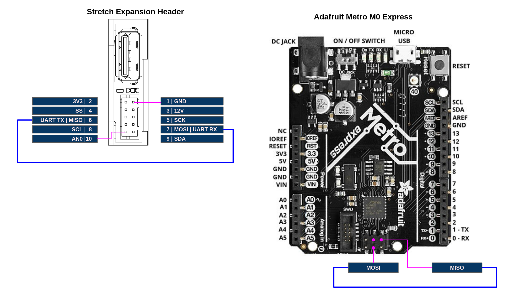

**NOTE** It is possible to brick the Wacc board by incorrectly configuring the hardware peripherals of the SAMD uC. Therefore, when integrating your custom hardware into the Wacc we strongly recommend emulating the Wacc board until the functionality is complete. The tutorial [Wacc Emulation](./tutorial_wacc_emulation.md) describes how to configure an Adafruit Metro M0 Express to behave as a stand-in for a Wacc board.

**NOTE**: These tutorials may require the latest version of Stretch Body. If necessary, please update your install.

# Integrating a Serial Device

This tutorial illustrates the integration of a UART device on to the [Wrist Expansion header](https://docs.hello-robot.com/hardware_user_guide/#wrist). We recommend first reading [Data Transfer](./tutorial_data_transfer.md) tutorial to understand how data is transfered back and forth from Stretch Body to the SAMD uC. 

In this tutorial we will extend the [Stretch Body Wacc](https://github.com/hello-robot/stretch_body/blob/master/body/stretch_body/wacc.py) class to send 10 floats down to the custom serial device. The serial device will echo the 10 floats back up to Stretch Body.

For the purposes of the tutorial we will wire the Wacc up in a loopback configuration as a stand-in for an actual physical serial device.

## Loopback Hardware Setup

Connect the UART TX pin to the UART RX pin of the Stretch Expansion Header (or the Metro M0 if emulating the Wacc). Connector information for the Expansion Header is found in the [Hardware Guide](https://docs.hello-robot.com/hardware_user_guide/#wrist-expansion-header).




### Flash Firmware

Pull down the latest version of Stretch Firmware

```bash
>>$ cd ~/repos
>>$ git clone https://github.com/hello-robot/stretch_firmware
```

Next, program the (emulated) Wacc with the provided sketch, [hello_wacc_serial](https://github.com/hello-robot/stretch_firmware/tree/master/tutorials/arduino/hello_wacc_serial). Be sure to:

* Select the board's port from the IDE under Tools/Port
* Select the board 'Hello Wacc' from the IDE under Tools/Board

### Firmware Code Walk-through

First, in the sketch `setup()` we configure enable the SerialExt device

```c
  SerialExt.begin(115200);
```

Next, in [Common.h](hhttps://github.com/hello-robot/stretch_firmware/tree/master/tutorials/arduino/hello_wacc_serial/Common.h) we define Command data to send down from Stretch Body to the serial device. We also define Status data to report back to Stretch Body. For our example we'll send 10 floats down and 10 floats back up.

```c
struct __attribute__ ((packed)) SerialExtCommand{
  float data[10];
};
struct __attribute__ ((packed)) SerialExtStatus{
  float data[10];
};
```

In `Wacc.cpp` we add the code that will communicate with the serial device. Whenever Stretch Body pushes a new command down the Wacc, this function will get called.  Here we are writing the Command data to the SerialExt port. We then send back in the Status message the data we read from SerialExt. As it is a physical loopback connection, the data back in Status will be the same as the Command message.

```c
void serial_comms()
{
  char * data_down=(char*)&(cmd.serial.data[0]);
  char * data_up=(char*)(stat.serial.data);
  for(int i=0;i<40;i++)
  {
    SerialExt.write(data_down+i,1);
  }
  for(int i=0;i<40;i++)
  {
    if (SerialExt.available())
    {
      data_up[i]=SerialExt.read();
    }
  }
}
```


## Stretch Body Code Walk-through

We provide an example class [WaccSerialExt](https://github.com/hello-robot/stretch_firmware/tree/master/tutorials/python/wacc_serial_ext.py) that extends the Wacc class of Stretch Body. This class provides two call backs that will get called on `pull_status` and `push_command` respectively. Here we see the packing and unpacking of the 10 floats found in [Common.h](https://github.com/hello-robot/stretch_firmware/tree/master/tutorials/arduino/hello_wacc_serial/Common.h) 

```python
    def ext_unpack_status(self,s):
        """
        s: byte array to unpack
        return: number of bytes unpacked
        """
        sidx=0
        for i in range(self.n_float):
            self.status['serial_ext'][i] = unpack_float_t(s[sidx:])
            sidx+=4
        return sidx
    
    def ext_pack_command(self,s,sidx):
        """
        s: byte array to pack in to
        sidx: index to start packing at
        return: new sidx
        """
        for i in range(self.n_float):
            pack_float_t(s, sidx, self._command['serial_ext'][i])
            sidx += 4
        return sidx
```

We also define a function that generates a new 'command' down to the serial device. In this case it just increments the 10 floats by one:

```python
    def serial_data_increment(self):
        for i in range(self.n_float):
            self._command['serial_ext'][i] =float(self._command['serial_ext'][i]+1)
        self._dirty_command=True
```


Finally, we do a simple test of the class with the tool [stretch_wacc_serial_jog.py](https://github.com/hello-robot/stretch_firmware/tree/master/tutorials/python/stretch_wacc_serial_jog.py)

```python
from wacc_serial_ext import WaccSerialExt
w=WaccSerialExt()
w.startup()
try:
    while True:
        print('Hit enter to do TX/RX cycle')
        raw_input()
        w.serial_data_increment()
        w.push_command()
        print('TX to SerialExt', w._command['serial_ext'])
        w.pull_status()
        print('RX from SerialExt', w.status['serial_ext'])
except (KeyboardInterrupt, SystemExit):
    w.stop()
```

Run it from the command line and verify that the 10 floats are being command down to your serial device, through the loopback connection, and back, up to the WaccSerialExt class:

```bash
>>$ cd ~/repos/stretch_firmware/tutorial/python
>>$ ./stretch_wacc_serial_jog.py 
Hit enter to do TX/RX cycle
..
('TX to SerialExt', [2.0, 3.0, 4.0, 5.0, 6.0, 7.0, 8.0, 9.0, 10.0, 11.0])
('RX from SerialExt', [1.0, 2.0, 3.0, 4.0, 5.0, 6.0, 7.0, 8.0, 9.0, 10.0])
Hit enter to do TX/RX cycle

('TX to SerialExt', [3.0, 4.0, 5.0, 6.0, 7.0, 8.0, 9.0, 10.0, 11.0, 12.0])
('RX from SerialExt', [2.0, 3.0, 4.0, 5.0, 6.0, 7.0, 8.0, 9.0, 10.0, 11.0])
Hit enter to do TX/RX cycle

..
```

NOTE: It takes one control cycle for the command values to be reported back to the status

------
<div align="center"> All materials are Copyright 2022 by Hello Robot Inc. Hello Robot and Stretch are registered trademarks. The Stretch RE1 and RE2 robots are covered by U.S. Patent 11,230,000 and other patents pending.</div>

