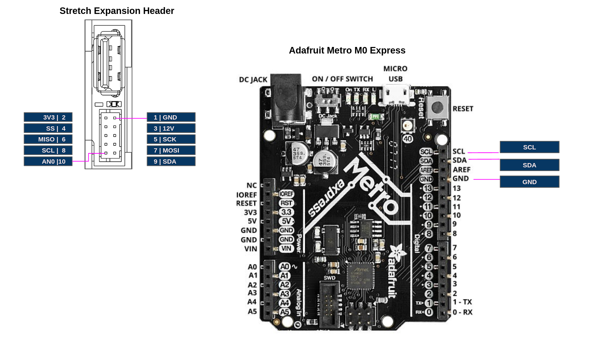

# Overview

This tutorial illustrates the integration of a I2C device on to the [Wrist Expansion header](https://docs.hello-robot.com/hardware_user_guide/#wrist). It extends t. We recommend doing the [Data Transfer](./data_transfer.md) tutorial first. 

# Calculator via I2C

In this tutorial we will run the calculator from the [Data Transfer](./data_transfer.md) tutorial on an Adafruit Metro M0 Express (Arduino Zero) that is running as an I2C slave. It will take a calculator `Command` from the Wacc and return the result in `Status` message. 




### Flash Firmware

First, program the Metro with the provided sketch, [zero_wacc_i2c](../arduino/zero_wacc_i2c). Be sure to:

* Select the board's port from the IDE under Tools/Port
* Select the board 'Arduino UNO' from the IDE under Tools/Board


Next, program the Wacc with the provided sketch, [hello_wacc_i2c](../arduino/hello_wacc_i2c). Be sure to:

* Select the board's port from the IDE under Tools/Port
* Select the board 'Adafruit M0 Express' from the IDE under Tools/Board

### Code Walk-through

The code is straightforward and is a natural extension of the code described in the  [Data Transfer](./data_transfer.md) tutorial. A few sections to highlight in the  [hello_wacc_i2c](../arduino/hello_wacc_i2c) sketch are:


In`setupWacc()` we add code to configure the I2C. 

```c
Wire.begin(); 
```

In `Wacc.cpp` we add the I2C code:

```c
#include <Wire.h>

uint8_t i2c_out[9];   //I2C data out
uint8_t i2c_in[9];    //I2C data in
uint8_t ds_i2c_cnt=0; //Down sample counter
float FS_I2C = 10;    //Rate to run transactions (Hz)
int buf_idx=0;

void i2cTransaction()
{
  //Send the commmand
  memcpy(i2c_out, (uint8_t *) (&cmd.calc), sizeof(Calc_Command));
  Wire.beginTransmission(4); // transmit to device #4
  for(int i=0;i<sizeof(Calc_Command);i++)
  {
    Wire.write(i2c_out[i]);
  }
  Wire.endTransmission();    

  //Get the result
  Wire.requestFrom(4, sizeof(Calc_Status));
  int buf_idx=0;
  while (Wire.available() && buf_idx<sizeof(Calc_Status)) // loop through all but the last
  {
    uint8_t x = Wire.read();      
    i2c_in[buf_idx++]=x;
  }
  memcpy((uint8_t *) (&stat.calc),i2c_in,  sizeof(Calc_Status));
}
```

Here, the 9 bytes of the `Calc_Command` are transferred out and the 4 bytes of the `Calc_Status` are received. 

**Note: This simple communication protocol is not robust to handshaking errors, etc**

**Note: The Wacc uses I2C to also communicate with its onboard accelerometer** --  the [ADXL343](https://www.analog.com/media/en/technical-documentation/data-sheets/ADXL343.pdf).  In our example we are using I2C address `4` to communicate with our Metro slave. The ADXL343 is configured to use addrex `0xA6` for a write and `0xA7` for a read.

Finally, we call the `i2cTransaction()` function at a rate of `FS_I2C` by adding to `stepWaccController()`:

```c
 if (ds_i2c_cnt++ >= (FS_CTRL / FS_I2C))
  {
    ds_i2c_cnt = 0;
    i2cTransaction();
  }
```

### Wire Up the Boards

Next, wire the Metro to the Expansion Header as:

| Stretch Expansion Header | Uno  |
| ------------------------ | ---- |
| SCL                      | SCL  |
| SDA                      | SDA  |
| GND                      | GND  |

### Test the Calculator

Now, test the setup using the provided tool, [stretch_wacc_calc_jog.py](../python/stretch_wacc_calc_jog.py). As shown below, The Metro performs the calculation of 12*13 and the result is report back to Stretch Body.

```bash
hello-robot@stretch-re1-100x:~$ cd repos/stretch_firmware/tutorial/python/
hello-robot@stretch-re1-100x:~/repos/stretch_firmware/tutorial/python$ ./stretch_wacc_calc_jog.py 
------ MENU -------
m: menu
r: reset board
a: set D2 on
b: set D2 off
c: set D3 on
d: set D3 off
X: do calculation
-------------------
X
---Calculate Op(Var1,Var2) ---
Op=0: Add
Op=1: Mult
Op=2: Div
Enter Op
1
Enter Var1
12
Enter Var2
13
------ MENU -------
m: menu
r: reset board
a: set D2 on
b: set D2 off
c: set D3 on
d: set D3 off
X: do calculation
-------------------

------------------------------
Ax (m/s^2) 0.0488623343408
Ay (m/s^2) 0.155020624399
Az (m/s^2) -10.0049753189
A0 349
D0 (In) 0
D1 (In) 1
D2 (Out) 70
D3 (Out) 0
Single Tap Count 26
State  0
Debug 0
Timestamp 1591588745.27
Board version: Wacc.Guthrie.V1
Firmware version: Wacc.v0.0.1pMySPI
Calc: 156.0
------ MENU -------
m: menu
r: reset board
a: set D2 on
b: set D2 off
c: set D3 on
d: set D3 off
X: do calculation
-------------------

```
