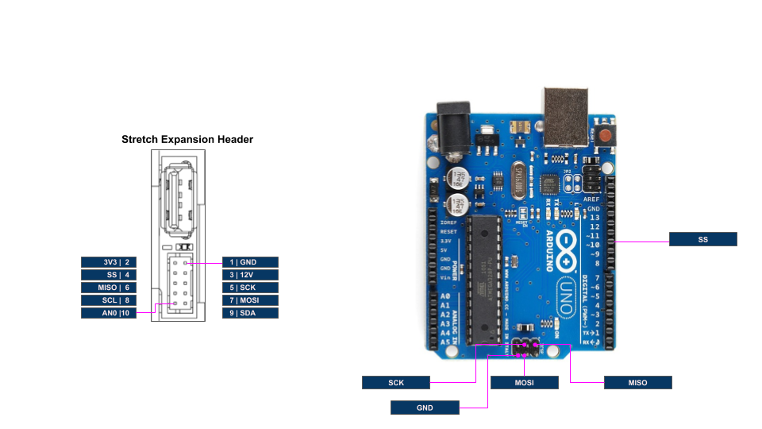
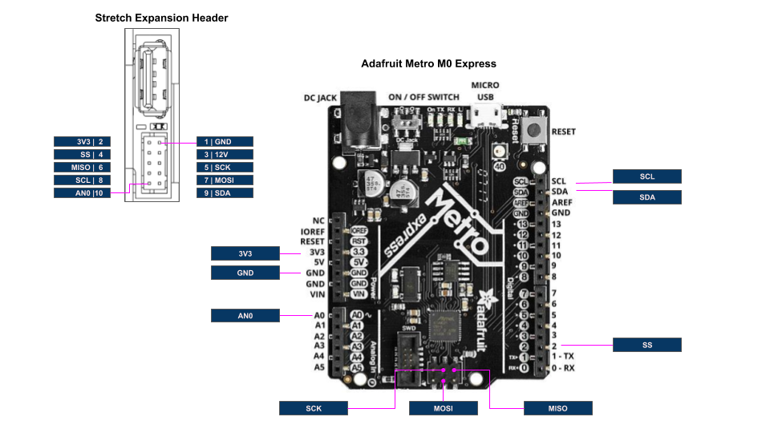

# Overview

This tutorial illustrates the integration of a SPI device on to the [Wrist Expansion header](https://docs.hello-robot.com/hardware_user_guide/#wrist). It extends the [Data Transfer](./data_transfer.md) tutorial. We recommend doing this tutorial prior to doing this one.

# Calculator via SPI

In this tutorial we will run the calculator from the [Data Transfer](./data_transfer.md) tutorial on an Arduino Uno that is running as an SPI slave. It will take a calculator `Command` from the Wacc and return the result in `Status` message. 




### Flash Firmware

First, program the Uno with the provided sketch, [uno_wacc_spi](../arduino/uno_wacc_spi). Be sure to:

* Select the board's port from the IDE under Tools/Port
* Select the board 'Arduino UNO' from the IDE under Tools/Board


Next, program the Wacc with the provided sketch, [hello_wacc_spi](../arduino/hello_wacc_spi). Be sure to:

* Select the board's port from the IDE under Tools/Port
* Select the board 'Hello Wacc' from the IDE under Tools/Board

### Code Walk-through

The code is straightforward and is a natural extension of the code described in the  [Data Transfer](./data_transfer.md) tutorial. A few sections to highlight in the  [hello_wacc_spi](../arduino/hello_wacc_spi) sketch are:

First, in the sketch `setup()` we configure the slave select pin to be an output

```c
pinMode(HEADER_SPI_SS,OUTPUT);
```

Next in `setupWacc()` we add code to configure the SPI

```c
SPISettings settingsA(100000, MSBFIRST, SPI_MODE1);
SPI.begin();
SPI.beginTransaction(settingsA);
```

In `Wacc.cpp` we add the SPI code:

```c
#include <SPI.h>

uint8_t spi_out[9];   //SPI data out
uint8_t spi_in[4];    //SPI data in
uint8_t ds_spi_cnt=0; //Down sample counter
float FS_SPI = 10;    //Rate to run transactions (Hz)

void spiTransaction()
{
  digitalWrite(HEADER_SPI_SS, LOW);
  SPI.transfer('X'); //Mark start of transaction
  memcpy(spi_out, (uint8_t *) (&cmd.calc), sizeof(Calc_Command));
  for (uint8_t idx = 0; idx < 9; idx++)
    spi_in[idx] = SPI.transfer(spi_out[idx]);
  digitalWrite(HEADER_SPI_SS, HIGH);
  memcpy((uint8_t *) (&stat.calc),spi_in+1,  sizeof(Calc_Status));
}
```

Here, the 9 bytes of the `Calc_Command` are transferred out and the 4 bytes of the `Calc_Status` are received. 

**Note: This simple communication protocol is not robust, using an 'X' to demarcate the start of a transaction**

Finally, we call the `spiTransaction()` function at a rate of `FS_SPI` by adding to `stepWaccController()`:

```c
 if (ds_spi_cnt++ >= (FS_CTRL / FS_SPI))
  {
    ds_spi_cnt = 0;
    spiTransaction();
  }
```

### Wire Up the Boards

Next, wire the Uno to the Expansion Header as:

| Stretch Expansion Header | Uno  |
| ------------------------ | ---- |
| SS                       | SS   |
| MISO                     | MISO |
| MOSI                     | MOSI |
| SCK                      | SCK  |
| GND                      | GND  |

### Test the Calculator

Now, test the setup using the provided tool, [stretch_wacc_calc_jog.py](../python/stretch_wacc_calc_jog.py). As shown below, The Arduino Uno performs the calculation of 12*13 and the result is report back to Stretch Body.

```bash
hello-robot@stretch-re1-100x:~$ cd repos/stretch_firmware/tutorial/python/
hello-robot@stretch-re1-100x:~/repos/stretch_firmware/tutorial/python$ ./stretch_wacc_calc_jog.py 
------ MENU -------
m: menu
r: reset board
a: set D2 on
b: set D2 off
c: set D3 on
d: set D3 off
X: do calculation
-------------------
X
---Calculate Op(Var1,Var2) ---
Op=0: Add
Op=1: Mult
Op=2: Div
Enter Op
1
Enter Var1
12
Enter Var2
13
------ MENU -------
m: menu
r: reset board
a: set D2 on
b: set D2 off
c: set D3 on
d: set D3 off
X: do calculation
-------------------

------------------------------
Ax (m/s^2) 0.0488623343408
Ay (m/s^2) 0.155020624399
Az (m/s^2) -10.0049753189
A0 349
D0 (In) 0
D1 (In) 1
D2 (Out) 70
D3 (Out) 0
Single Tap Count 26
State  0
Debug 0
Timestamp 1591588745.27
Board version: Wacc.Guthrie.V1
Firmware version: Wacc.v0.0.1pMySPI
Calc: 156.0
------ MENU -------
m: menu
r: reset board
a: set D2 on
b: set D2 off
c: set D3 on
d: set D3 off
X: do calculation
-------------------

```

# Integrating other Hardware

**Note: It is possible to brick an Arduino during SPI development. Develop your application on an off-the-shelf Arduino before porting to the Wacc.**

The Stretch Wacc board uses the same microcontroller as used on an Arduino Zero or a Adafruit Metro M0 Express, so it can be useful to first develop your SPI application on this board and then port it to run on the Stretch Wacc (Wrist + Accelerometer) board. 

We recommend:

* Develop your SPI sensor application on an Arduino Zero or equivalent
* Port your application to the Wacc using the above tutorial as a guide
* Plumb the data back to Stretch Body using the [Data Transfer](./data_transfer.md) tutorial as a guide


The mapping between the Wacc and an Metro M0 is shown below.

